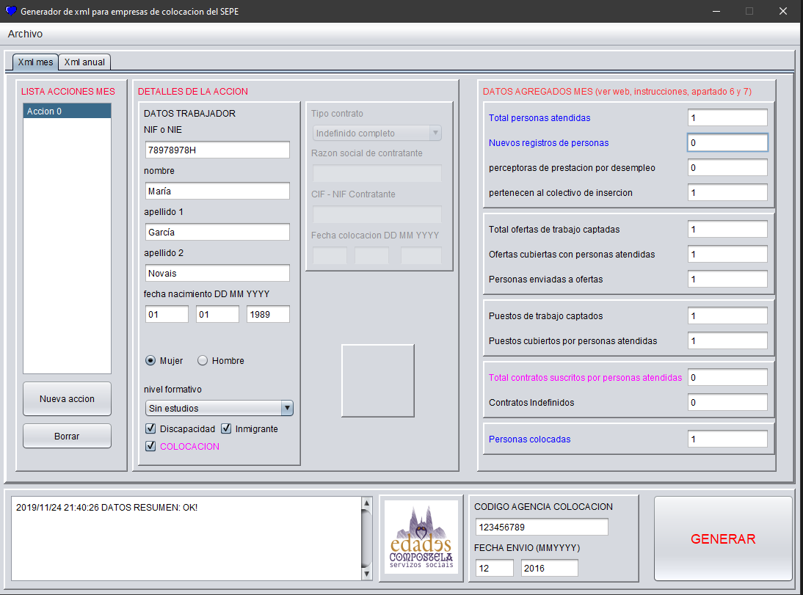

# XML-EmpresasColocacion-SEPE
Generador de informes xml de las empresas de colocación telemáticas para el SEPE.

Proyecto NetBeans 11.0 con Java Swing para Escritorios, es un cliente de escritorio para generar los informes que exige la legislación española a las empresas de colocación telemáticas sobre su actividad. Los archivos deben subirse a la web https://www.sistemanacionalempleo.es/et_comun.html según sus instrucciones. La aplicación facilita la interpretación de las instrucciones.

Actualmente (2019) en uso por la empresa www.edadescompostela.com

